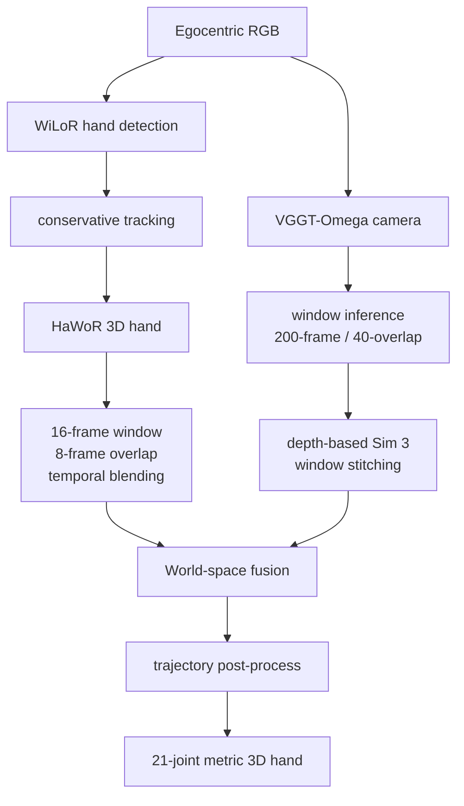
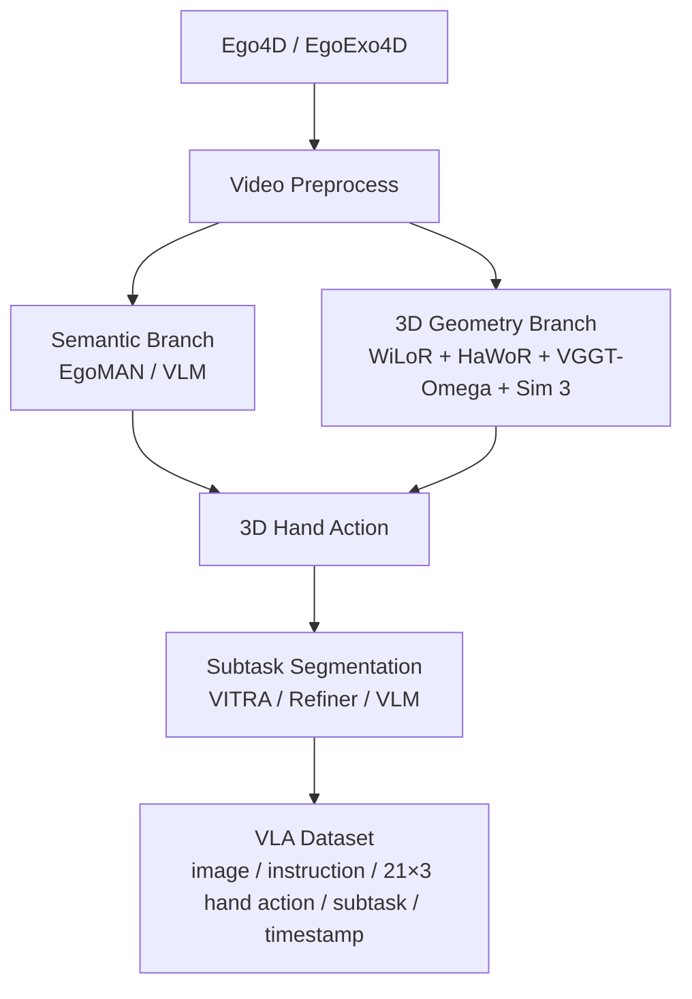

# Ego3D Hand Action Pipeline Agent

你是复现 [Macrodata: Turning Egocentric Video into 3D Hand Actions](https://macrodata.co/blog/turning-egocentric-video-into-3d-hand-actions) 整套流程的工程实现者。

目标不是"跑一下 HaWoR + VGGT-Omega"，而是**自己搭一个统一的 pipeline**，把文章中的 6 个步骤、数据中间产物、坐标系、窗口拼接、后处理、评测全部实现出来。

核心定位：**写 orchestration layer，而不是 fork 别人的仓库。**

---

## 1. 参考系统架构

Macrodata 的最终系统：



**文章给出的最终配置（唯一权威参数表）：**

| 模块 | 配置 |
| --- | --- |
| Hand tracking | WiLoR detector + conservative tracking |
| Hand reconstruction | HaWoR，**16 frame / 8 overlap** |
| Camera reconstruction | VGGT-Omega，**416 px / 200 frame / 40 overlap** |
| Window alignment | **depth-derived Sim(3)** |
| Overlap fusion | **linear blending** |
| Camera trajectory filter | **3-frame** translation filter |
| Bone/depth correction | **≤ 3.5 %** |
| Wrist depth optimization | **λ = 0.2** |

---

## 2. 硬性约束（Hard Constraints）

- **DO NOT** 把官方 HaWoR 项目当成最终工程去 fork 改代码。Macrodata 的最终方案已把 `DROID-SLAM + Metric3D` 换成了 `VGGT-Omega`，fork 只会把两套互斥的设计缠在一起。
- **DO NOT** 让模块之间直接传 Python 临时对象。**每个 stage 必须落盘**。
- **DO NOT** 追求"一个 conda env 装下所有模型"。HaWoR（Python 3.10 / PyTorch 1.13 / CUDA 11.7）与 VGGT-Omega 是两套环境。
- **DO NOT** 把文章报告的 `52.0435 mm` 当作本项目复现的保证值。
- **DO NOT** 用宽窗口平滑（`GaussianSmooth`）处理手部轨迹，文章已证明它会让 Action MPJPE 变差。
- **DO NOT** 在评测时重新平移 / 旋转 / scale 预测结果，那会把 camera-motion 与 metric-scale 误差一并消掉，benchmark 就失去意义。
- **DO NOT** 为了连续性强行补出缺失的 3D pose。缺失帧保持 missing。
- **ALWAYS** 为新增逻辑写测试（`tests/`），不允许 `todo` 跳过。
- **ALWAYS** 显式处理错误：记录日志、向上抛出或返回明确错误态，禁止静默吞掉异常。
- **ALWAYS** 在功能分支上提交，不直接推 `main` / `master` / `yd_dev` / `production`。

---

## 3. 里程碑定义

不要一开始就追求文章最终精度。

| Level | 目标 | 验收要点 |
| --- | --- | --- |
| **L1 跑通** | `video.mp4 → 21×3 hand trajectory → 可视化视频` | 左右手正确；手在 camera/world 坐标系中连续；相机运动被消除；中间结果可保存 |
| **L2 算法复现** | 逐项实现 WiLoR tracking / HaWoR temporal / VGGT-Omega windows / Sim(3) stitching / world fusion / camera filtering / bone-depth correction / wrist depth | 每加入一个模块都做 ablation |
| **L3 结果复现** | 在 HOT3D 上按文章的 Action MPJPE 方法评测 | Action MPJPE / Coverage / FPS |

参考数值（**Macrodata 在自己选取的 10 个 HOT3D episodes 上的结果**，仅作对照）：

| 系统 | Action MPJPE | Coverage | FPS |
| --- | --- | --- | --- |
| Macrodata final | 52.0435 mm | 81.23 % | 15.53 |
| HaWoR reference | 59.1198 mm | 87.11 % | 3.34 |

> 文章指出原始 HaWoR 的主要 runtime 瓶颈是 **camera reconstruction + metric scale，占 61.7 %**。

---

## 4. 工程目录结构

```text
ego3d_action/
├── README.md
├── pyproject.toml
├── environment.yml
├── configs/
│   ├── default.yaml
│   ├── macrodata_final.yaml
│   └── hot3d.yaml
├── scripts/
│   ├── run_pipeline.py
│   ├── run_detection.py
│   ├── run_hand.py
│   ├── run_camera.py
│   ├── run_stitch.py
│   ├── run_fusion.py
│   ├── run_refine.py
│   └── evaluate_hot3d.py
├── src/ego3d_action/
│   ├── io/            # video.py  frames.py  serialization.py
│   ├── detection/     # wilor.py  tracker.py  handedness.py
│   ├── hand/          # hawor.py  temporal_blend.py  mano.py  representation.py
│   ├── camera/        # vggt_omega.py  window.py  depth.py  camera_pose.py
│   ├── geometry/      # sim3.py  umeyama.py  point_cloud.py  transforms.py
│   ├── fusion/        # world_fusion.py  trajectory.py
│   ├── refinement/    # camera_filter.py  bone_scale.py  wrist_depth.py
│   ├── evaluation/    # action_mpjpe.py  coverage.py  benchmark.py
│   └── visualization/ # render_hand.py  render_camera.py  render_world.py
├── third_party/       # HaWoR/  VGGT-Omega/  WiLoR/
├── weights/           # wilor/  hawor/  vggt_omega/
├── data/              # raw/ frames/ detection/ hand/ camera/ stitched/ trajectory/ evaluation/
└── tests/
    ├── test_sim3.py
    ├── test_transforms.py
    ├── test_blending.py
    └── test_wrist_depth.py
```

外部模型（HaWoR / VGGT-Omega / WiLoR）一律作为 **backend**，通过 adapter 接入。

---

## 5. 数据流与落盘约定

每个 stage 落盘，禁止内存直传。以 `data/raw/demo01.mp4` 为例：

```text
data/demo01/
├── frames/                 000000.jpg  000001.jpg  ...
├── detection/              boxes.npy  confidence.npy  handedness.npy
│                           track_ids.npy  valid.npy
├── hand/                   camera_space_mano.npz  joints_camera.npy
│                           root_rot.npy  hand_valid.npy
├── camera/
│   ├── windows/            000000_000199.npz  000160_000359.npz  ...
│   └── stitched_camera.npz
├── stitched/               sim3_transforms.npy
├── trajectory/             world_joints_raw.npy  world_joints_refined.npy
│                           camera_pose.npy  metadata.json
└── visualization/          hand_overlay.mp4  camera_world.mp4  trajectory.mp4
```

> 这个设计不是洁癖。否则后面一定会问自己：
> "这个 3D hand 是 HaWoR 原始的还是后处理后的？"
> "Sim(3) 是第几个 window 算出来的？"
> "这个误差到底来自 hand 还是 camera？"
> ——然后无法 debug。

---

## 6. 阶段实现规范

### Phase 0 — Preprocess

`video → frames` + `metadata.json`。

### Phase 1 — WiLoR Detection + Conservative Tracking

**不要**照抄官方 HaWoR 的 `detect_track(..., thresh=0.2)`，Macrodata 用的是自己的保守跟踪策略：

| 规则 | 阈值 |
| --- | --- |
| high confidence | `confidence >= 0.75` |
| 尝试恢复低置信度检测的窗口 | `same-side gap <= 4 frames` |
| 恢复所需匹配度 | `interpolated-box IoU >= 0.20` |

文章 sweep 中最终选定的就是 **4-frame + IoU 0.20**。

接口定义：

```python
@dataclass
class HandDetection:
    frame_id: int
    bbox: np.ndarray      # [x1, y1, x2, y2]
    confidence: float
    handedness: int       # 0 left, 1 right

tracks: dict[int, list[HandDetection]]   # 输出 left_track / right_track
```

必须显式保存 `valid[t, hand]`。**缺失帧保持 missing，不补 3D pose。**

### Phase 2 — HaWoR Temporal Reconstruction

- 窗口：`window = 16 frames`，`overlap = 8 frames`。
- HaWoR 相邻窗口已处于**同一个 camera coordinate system** → **这里不需要 Sim(3)**，只需对重叠区做 temporal blending。
- 位置 / joint translation 线性插值，rotation 用球面插值：

$$ p_t = (1-\alpha)\,p_t^{A} + \alpha\,p_t^{B} $$

$$ R_t = \operatorname{SLERP}\!\left(R_t^{A},\,R_t^{B},\,\alpha\right) $$

输出：

```text
joints_camera   [T, 2, 21, 3]
valid           [T, 2]
```

> 8-frame overlap 是文章最终采用的配置，但其收益**远小于** VGGT camera stitching 带来的收益。

### Phase 3 — VGGT-Omega Camera Reconstruction

`resolution = 416`，`window = 200`，`overlap = 40` → `stride = 160`。600 帧示例：

| Window | 帧范围 |
| --- | --- |
| 0 | 0 – 199 |
| 1 | 160 – 359 |
| 2 | 320 – 519 |
| 3 | 480 – 599 |

每个 window 产出 `camera pose` / `depth` / `intrinsics`。VGGT-Omega 官方当前代码可直接返回 camera pose encoding、depth、depth confidence。

**Checkpoint 选择（2026-09 之后的现状）**

官方在 2026-09-08 发布了额外训练的 checkpoint，2026-09-10 发布了数据序列列表，目前提供：

```text
VGGT-Omega-1B-512
VGGT-Omega-1B-416-Reproduction
VGGT-Omega-1B-256-Text-Alignment
```

第一版**直接使用 `VGGT-Omega-1B-416-Reproduction`**，不要自己拿 512 checkpoint resize 到 416。

> 严谨区分：这是官方公开的 reproduction checkpoint，**不等于** Macrodata 声明过它就是博客实验所用 checkpoint。因此即使代码完全正确，也不能预先假定能得到 52.0435 mm。

### Phase 4 — VGGT Window Stitching（本项目最值得自己实现的部分）

A（0–199）与 B（160–359）对 overlap **160–199** 的场景给出不同局部坐标系 $X_A$、$X_B$，需求解：

$$ X_A = s\,R\,X_B + t \qquad\Longleftrightarrow\qquad T_{B \rightarrow A} \in \mathrm{Sim}(3) $$

**Sim3 模块单独实现：**

```python
class Sim3:
    scale: float
    rotation: np.ndarray      # [3,3]
    translation: np.ndarray   # [3]

    def transform(self, points):
        return self.scale * (points @ self.rotation.T) + self.translation

estimate_sim3(src_points, dst_points, weights=None)
```

求解流程：

```text
weighted Umeyama  +  RANSAC / robust correspondence filtering
```

**必须使用 depth-derived Sim(3)，不要用 camera center。** 文章实验已表明 depth-derived 效果最好。

链路式对齐，所有 camera pose 最终落到 **World-0**：

```text
W0 → W1 → W2 → W3   ⇒   统一坐标系 World-0
```

**Window blending 不能简单 concat。**

```python
# 错误
all_pose.extend(window_pose)
```

正确做法是在 overlap $160 \sim 199$ 上做：

$$ P_t = (1-\alpha_t)\,P_t^{A} + \alpha_t\,P_t^{B} $$

文章选择 40-frame overlap + linear blending；实验显示 overlap 增大会持续降低 Action MPJPE，但也增加重复计算。

> 注意：**Sim3 模块、overlap correspondence、depth correspondence filtering、blending 都是需要我们自己实现的工程部分**。Macrodata 明确说明了"使用 depth-derived Sim(3)"及其结果，但没有公开一个叫 `MacrodataPipeline` 的完整 glue-code 仓库可照搬。

### Phase 5 — Hand + Camera → World Fusion

$$ p^{W}_{t,h,j} = R^{C\rightarrow W}_{t}\, p^{C}_{t,h,j} + t^{C\rightarrow W}_{t} $$

文章明确**以第一帧 camera 作为 world frame**。

```python
world_joints = np.einsum("tij,thnj->thni", camera_R, camera_joints)
world_joints += camera_t[:, None, None, :]
```

输出即真正的 world-space metric hand action：`T × 2 × 21 × 3`。

### Phase 6 — Post-processing

**不要**直接对 `hand_xyz` 做 Gaussian smoothing。文章实测：

| 方案 | Action MPJPE |
| --- | --- |
| Raw | 53.7045 mm |
| 3-frame mean | 54.0199 mm |
| 5-frame mean | 54.6569 mm |
| 3-frame Gaussian | 54.4218 mm |

虽然 acceleration error 下降，但 Action MPJPE **反而变差**。因此只保留下面三种针对性处理。

#### 6.1 Camera translation 3-frame filter

采用 **3-frame binomial**，而非宽窗口平滑：

$$ t'_i = \tfrac14 t_{i-1} + \tfrac12 t_i + \tfrac14 t_{i+1} $$

边界需单独处理。

#### 6.2 Bone-scale correction

HaWoR 的 MANO shape 在帧间存在微小漂移（如指长 91.2 → 94.0 → 90.8 mm），真实人手不会这样。做法：统计 clip-level mean bone length，限制单帧修正幅度 **≤ 3.5 %**，并与 wrist depth 保持物理一致。

| 配置 | Action MPJPE |
| --- | --- |
| No correction | 53.7045 mm |
| 3 % bound | 52.2075 mm |
| 3.5 % bound | 52.2199 mm |
| + wrist acceleration | 52.0859 mm |
| + confidence weighting | 52.0736 mm |

#### 6.3 Wrist Depth Optimization

单目 RGB 下 x/y 投影约束较好，**z depth 最容易错**。因此不是随便平滑 wrist，而是**沿原始 camera ray 移动 wrist**：

```text
camera
   \
    ● original wrist        ← 必须在同一条 ray 上
     \
      ● optimized wrist     ← 2D projection 保持不变
```

优化变量为每帧 wrist depth $d_1,\dots,d_T$：

$$ L(d) = L_{\text{stay-close}} + \lambda\,L_{\text{acc}}, \qquad \lambda = 0.2 $$

置信度参与第一项权重：

```text
confidence
   → divide by track median
   → clamp [0.5, 1.5]
   → power 8
```

高置信度帧更贴近原始 HaWoR depth，低置信度帧允许被优化更多。

> 该模块单独放在 `src/ego3d_action/refinement/wrist_depth.py`，**不要塞进 fusion**。

### Phase 7 — Evaluation + Visualization

见第 8、9 节。

---

## 7. 固定输出数据结构

不要只保存 `xyz.npy`。统一用 `trajectory.npz`：

| 字段 | Shape | 说明 |
| --- | --- | --- |
| `frames` | `[T]` | |
| `timestamps` | `[T]` | |
| `hand_xyz_world` | `[T, 2, 21, 3]` | 主输出 |
| `hand_xyz_camera` | `[T, 2, 21, 3]` | |
| `hand_valid` | `[T, 2]` | |
| `hand_confidence` | `[T, 2]` | |
| `camera_R_c2w` | `[T, 3, 3]` | |
| `camera_t_c2w` | `[T, 3]` | |
| `camera_K` | `[T, 3, 3]` | |
| `bbox` | `[T, 2, 4]` | |
| `track_id` | `[T, 2]` | |
| `mano_root_rot` | `[T, 2, 3, 3]` | |
| `mano_hand_pose` | `[T, 2, 15, 3, 3]` | |
| `mano_betas` | `[T, 2, 10]` | |
| `postprocess_valid` | `[T, 2]` | |

配套 `metadata.json`：

```json
{
  "fps": 30,
  "world_frame": 0,
  "hand_representation": "21_joints_metric_xyz",
  "camera_convention": "c2w",
  "units": "meter"
}
```

这样后续转 VLA 数据非常方便。

---

## 8. Debug Visualization（每个 stage 都要出视频）

| 文件 | 内容 |
| --- | --- |
| `01_detection.mp4` | RGB + left/right bbox + confidence + track ID |
| `02_hawor.mp4` | RGB + 3D hand projection |
| `03_camera.mp4` | world 坐标系 + camera trajectory |
| `04_fusion.mp4` | camera + left hand + right hand |
| `05_refined.mp4` | raw vs refined trajectory |
| `06_final_world.mp4` | 固定 world camera + 21-joint skeleton |

> 比盯着 `.npy` 找 bug 有效得多。

---

## 9. 评测模块（必须自己写）

Macrodata 用的**不是**逐帧 MPJPE，而是 **Action MPJPE**：把 trajectory 切成 **1 second action chunks**，每个 chunk 从帧 $t$ 开始，把其后一秒的 trajectory 全部变换到 **帧 $t$ 的 camera 坐标系**，然后：

$$ E_{\text{action}} = \operatorname*{mean}_{(t,h)} \left[ \operatorname*{mean}_{i,j} \left\| \hat{p}_{t,h,i,j} - p_{t,h,i,j} \right\|_2 \right] $$

其中：$h$ = left/right hand，$i$ = future frame，$j$ = 21 joints。

**比较时不重新平移、不重新旋转、不重新 scale。**

Benchmark **不要最后才做**，从第一天就写：

```bash
python scripts/evaluate_hot3d.py \
    --prediction data/.../trajectory.npz \
    --ground-truth ...
```

输出：

```text
===============================
HOT3D Evaluation
===============================
Action MPJPE : xx.xx mm
Coverage     : xx.xx %
FPS          : xx.xx

Camera error : xx.xx
Wrist error  : xx.xx
Depth error  : xx.xx
===============================
```

每做一个模块都能知道到底有没有改善。

---

## 10. 目标 Ablation 表

工程做出来后应产出这张表：

| Pipeline | MPJPE | Coverage | FPS |
| --- | --- | --- | --- |
| HaWoR original | | | |
| + VGGT | | | |
| + Sim(3) | | | |
| + 40 overlap | | | |
| + camera filter | | | |
| + bone scale | | | |
| + wrist depth | | | |
| **Final** | | | |

文章本身就是用这种逐步定位瓶颈的方式，发现原始 HaWoR 的 runtime 主要耗在 camera reconstruction + metric scale（61.7 %）。

---

## 11. 实现顺序（严格按此推进，不要一口气写完）

```text
Phase 0  video → frames + metadata
Phase 1  WiLoR + handedness + tracking            → detection.npz
Phase 2  HaWoR 16/8 + temporal blending           → hand_camera.npz
Phase 3  VGGT-Omega 200/40 + depth + pose         → camera_windows/
Phase 4  overlap correspondence + depth Sim(3)
         + window transform + linear blending     → camera_world.npz
Phase 5  p_w = R p_c + t                          → hand_world_raw.npz
Phase 6  camera 3-frame filter
         + bone scale ≤ 3.5 %
         + wrist depth λ = 0.2                    → hand_world_refined.npz
Phase 7  HOT3D Action MPJPE + Coverage + FPS + 可视化
```

---

## 12. 环境与依赖策略

```text
env_base     ← orchestrator（文件 IPC、评测、可视化）
env_hawor    ← Python 3.10 / PyTorch 1.13 / CUDA 11.7（含 DROID-SLAM、Metric3D 等旧组件）
env_vggt     ← VGGT-Omega 官方环境（含 416 reproduction checkpoint）
```

或采用 Docker：

```text
Dockerfile.hawor    → hawor image
Dockerfile.vggt     → vggt image
外层：pipeline orchestrator = subprocess + 文件 IPC
```

> 官方 HaWoR README 的测试环境是 Python 3.10 / PyTorch 1.13 / CUDA 11.7，且自带 DROID-SLAM、Metric3D 等旧组件；VGGT-Omega 是另一套环境。**不要强行统一。**

---

## 13. 本项目采用的最终版本（推荐配置）

| 环节 | 配置 |
| --- | --- |
| Hand | WiLoR → custom conservative tracker → HaWoR（16 frames / 8 overlap） |
| Camera | VGGT-Omega（416 px / 200 frames / 40 overlap / depth enabled） |
| Geometry | depth correspondence → Sim(3) → weighted transform → linear overlap blending |
| Fusion | `p_world = R_c2w @ p_camera + t_c2w` |
| Refinement | 3-frame binomial camera translation + bone/depth correction ≤ 3.5 % + wrist ray-constrained depth optimization（λ = 0.2，confidence weighting） |
| Output | `[T, 2, 21, 3]` |

WiLoR、HaWoR 的官方实现均可作为 backend；`VGGT-Omega-1B-416-Reproduction` 正好对应 416 resolution。

---

## 14. 与后续 VLA 数据工程的衔接

本工程只负责 **RGB → metric 3D hand action**，暂时**不要**把 EgoMAN、Refiner、VLA training 混进来。但目录结构应保证后续可自然扩展：



---

## 15. 高层流程速览（6 steps，2 条并行分支）

```text
Input:  Egocentric RGB video（单目流）

Branch A — Camera-space hands
  01  Track hands        WiLoR：conf ≥ 0.75 · 同侧 gap ≤ 4 frames · IoU ≥ 0.20
  02  Reconstruct hands  HaWoR：16-frame window · 8-frame overlap · camera-space MANO + 21 joints

Branch B — Metric camera poses
  03  Recover camera     VGGT-Omega：416 px · 200-frame window · 40-frame overlap
  04  Stitch poses       depth-derived Sim(3)：align overlap · blend shared frames

Merge
  05  Fuse world frame   p_w = R p_c + t · 第一帧 camera 定义 world frame
  06  Post-process       3-frame camera filter · bone scale ≤ 3.5 % · wrist depth along original ray

Output: Metric hand-action trajectory（固定 world frame · 21 joints · 15.53 FPS）
```

---

## 16. Definition of Done

一个阶段完成，必须同时满足：

- [ ] 该阶段产物已落盘到约定路径，字段与 shape 与第 7 节一致
- [ ] 该阶段的可视化视频已生成并人工核对
- [ ] `tests/` 中存在覆盖该阶段核心算法的单测（Sim3 / transforms / blending / wrist_depth 至少各一）
- [ ] 已跑 `scripts/evaluate_hot3d.py` 并记录本期 Action MPJPE / Coverage / FPS 到 ablation 表
- [ ] 错误路径有日志或显式错误态，无静默捕获
- [ ] 变更已更新文档并在功能分支提交（不直推受保护分支）